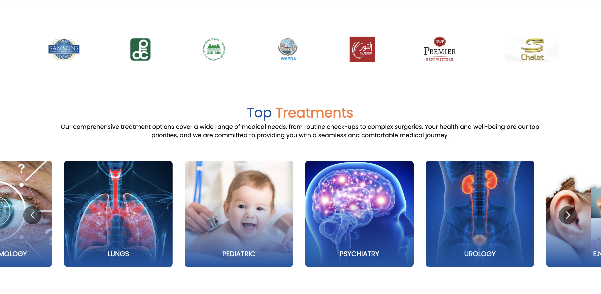
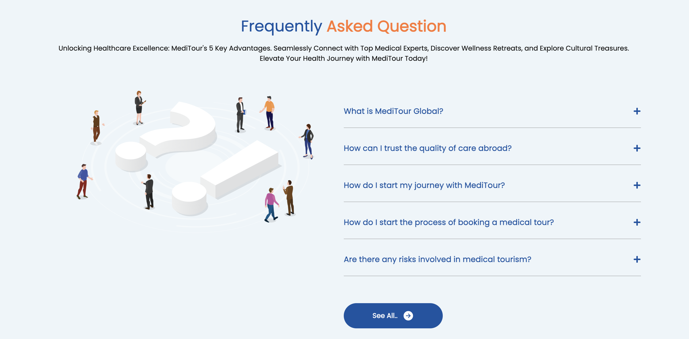
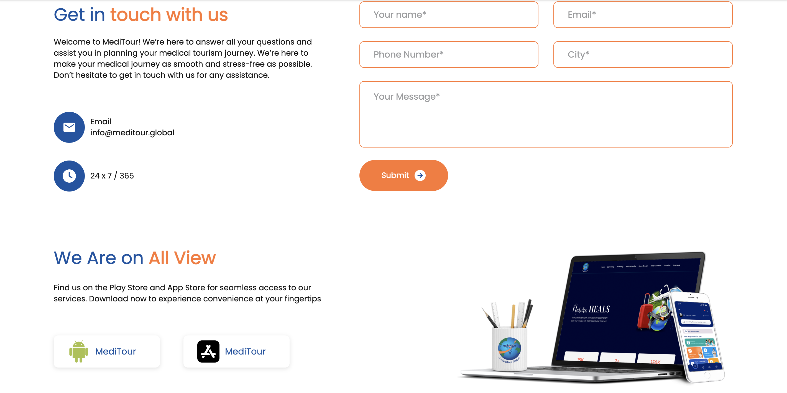

# **Meditour Global**

**Meditour Global** is a comprehensive **medical tourism platform** built with **React** and **CSS**. The platform connects patients with healthcare providers across the globe, offering a seamless experience for finding and booking medical treatments abroad. The project features a user-friendly interface, dynamic content, and integration with APIs for real-time data.

---

## **Table of Contents**

- [Description](#description)
- [Technologies Used](#technologies-used)
- [Features](#features)
- [Installation](#installation)
- [Folder Structure](#folder-structure)
- [Screenshots](#screenshots)
- [License](#license)

---

## **Description**

Meditour Global is a medical tourism platform that allows users to find and book healthcare services abroad. The website is built with **React** for the frontend and **Redux** for state management. It uses **Axios** for API requests to handle real-time data, offering patients a seamless and efficient platform for exploring medical treatments, destinations, and hospitals.

---

## **Technologies Used**

- **React**: A JavaScript library for building user interfaces with component-based architecture.
- **Redux**: A state management library for JavaScript apps, helping manage the global state of the application.
- **CSS**: For custom styling and responsive design.
- **Axios**: A promise-based HTTP client for making API requests to fetch data.
- **React Router**: For handling navigation between different sections of the website.
- **Bootstrap**: For some UI components and responsive layout (optional).

---

## **Features**

- **Responsive Design**: Optimized for both desktop and mobile devices, ensuring a smooth experience across all screen sizes.
- **State Management**: Redux is used to handle the global state, including user authentication, selected services, and more.
- **API Integration**: Axios is used for making API calls to fetch real-time data about hospitals, doctors, and available medical services.
- **User Authentication**: Secure login and registration functionality for users to book appointments.
- **Search and Filter**: Users can search for healthcare providers and filter based on location, treatment type, and more.
- **Booking System**: Allows users to book appointments with healthcare providers through an easy-to-use interface.
- **Location-based Services**: Integration of location-based services to find nearby medical providers.

---

## **Installation**

To set up and run the project locally, follow these steps:

1. **Clone the repository**:

   ```bash
   git clone https://github.com/your-username/Meditour-Global.git
   cd Meditour-Global
    npm install
    npm start
   ```

## **Folder Structure**

- `Meditour-Global/`
  - `src/` # Source code for the application
    - `components/` # Reusable UI components (header, footer, etc.)
    - `pages/` # React components for different pages (home, about, contact, etc.)
    - `redux/` # Redux store, reducers, and actions
    - `api/` # Axios API calls and configuration
    - `styles/` # CSS files for custom styling
    - `utils/` # Utility functions for various tasks
    - `App.js` # Main component of the app
    - `index.js` # Entry point of the React app
  - `public/` # Static assets (images, icons, etc.)
  - `package.json` # Project dependencies and scripts

## **Screenshots**







## **License**

This project is licensed under the **MIT License** - see the [LICENSE](./LICENSE) file for details.

---

### **MIT License Summary**:

The MIT License is a permissive open-source license that allows for the following:

- **Usage**: You can use, copy, modify, merge, publish, distribute, sublicense, and/or sell copies of the Software.
- **Attribution**: You must include the original copyright notice and license text in all copies or substantial portions of the Software.
- **Warranty Disclaimer**: The software is provided "as is", without warranty of any kind, express or implied, including but not limited to the warranties of merchantability, fitness for a particular purpose, and non-infringement.

For more details, see the full license text in the [LICENSE](./LICENSE) file.

---
